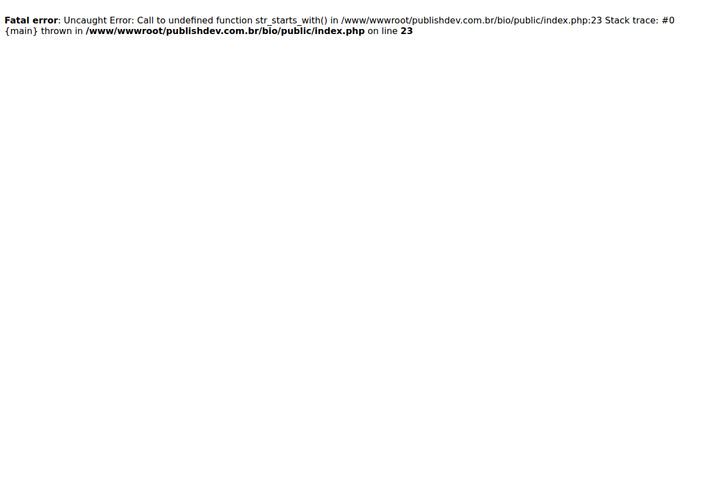

# 🔗 Bio — página de links personalizável

Página de "link na bio" no estilo Linktree, com painel administrativo próprio.
O dono edita links, aparência e conteúdo por uma interface web, sem mexer em código.

## ✨ Funcionalidades

- **Página pública** de links, otimizada para o celular
- **Painel administrativo** protegido por login
- **Gerenciamento de links**: criar, editar, reordenar e desativar
- **Personalização visual**: cores, fundo, botões e ícones
- **Upload de imagens** (foto de perfil e fundo)
- Biblioteca de **ícones** para redes sociais
- PHP puro, sem framework e sem dependências externas

## 📸 Tela

[](https://publishdev.com.br/bio/)

## 🧱 Stack

| Camada | Tecnologia |
|---|---|
| Backend | PHP 7.4 (sem framework) |
| Banco | MySQL / MariaDB |
| Front | HTML, CSS e JavaScript puro |

## 📦 Manual de instalação

### Requisitos

| Componente | Versão | Observação |
|---|---|---|
| PHP | 7.4+ | com `pdo_mysql`, `gd`, `fileinfo` |
| MySQL / MariaDB | 5.7+ / 10.3+ | `utf8mb4` |
| Apache | 2.4 | `DocumentRoot` apontando para `public/` |

### 1. Arquivos

```bash
git clone https://github.com/alequizao/bio.git
cd bio
```

Aponte o servidor para a pasta `public/` — o diretório `src/` **não** deve ser acessível
pela web.

### 2. Configurar

```bash
cp src/config.example.php src/config.php
```

Preencha em `src/config.php` os dados do banco e o usuário/senha do administrador
(`ADMIN_USER` / `ADMIN_PASS`). **Esse arquivo não vai para o Git.**

### 3. Banco

```sql
CREATE DATABASE bio CHARACTER SET utf8mb4 COLLATE utf8mb4_unicode_ci;
```

### 4. Permissões de upload

```bash
mkdir -p public/uploads
chown -R www-data:www-data public/uploads
```

### 5. Acessar

A página pública fica na raiz e o painel em `/admin.php`. **Troque a senha do
administrador antes de publicar.**

---

## 👨‍💻 Desenvolvedor

Projetado e desenvolvido **100% por Alex Junior (alequizao)** — da ideia ao deploy:
levantamento, modelagem do banco, backend, interface e publicação em produção.
Analista e Desenvolvedor de Sistemas em **Maceió, Alagoas**. Programador na
**Publish Digital**.

- **E-mail:** alequizao.dev@gmail.com
- **WhatsApp:** [(82) 98871-7072](https://wa.me/5582988717072)
- **Instagram:** [@alequizao](https://instagram.com/alequizao)
- **GitHub:** [@alequizao](https://github.com/alequizao) · [perfil completo](https://github.com/alequizao/alequizao)
- **Site:** [alequizao.com](https://alequizao.com)

---

© Código proprietário, desenvolvido sob encomenda.
